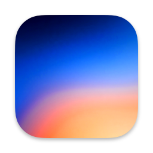
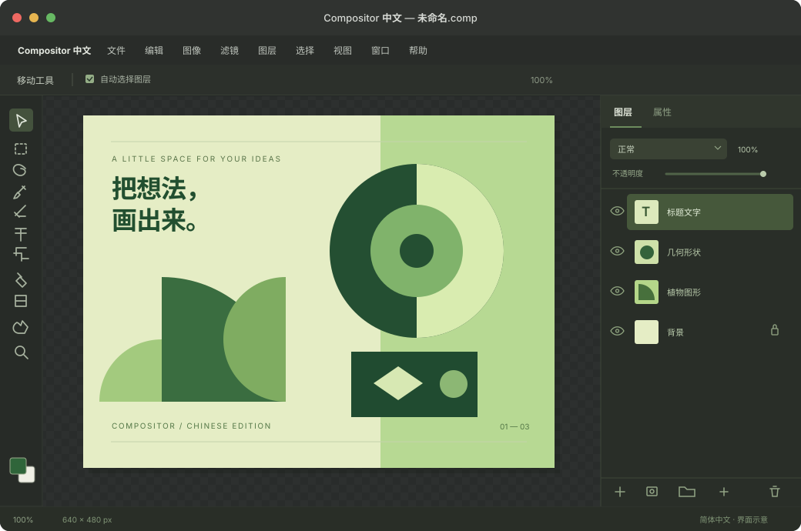

<p align="center">
  
</p>
<h1 align="center">Compositor 中文版</h1>
<p align="center">把熟悉的修图流程，换成中文。</p>
<p align="center"><strong>非官方中文构建 · 基于 Compositor 1.4.7 · 简体中文 / 繁體中文</strong></p>
<p align="center">
  <a href="https://github.com/Wawajiao-Wwj/Compositor-Chinese/releases/latest">下载中文版</a> ·
  <a href="https://Wawajiao-Wwj.github.io/Compositor-Chinese/">项目首页</a> ·
  <a href="docs/guide.md">安装与使用</a> ·
  <a href="https://github.com/robbietilton/Compositor">原项目</a>
</p>



> 上图为界面示意，展示中文版的主要布局和术语，并非实际编辑截图。本项目是独立的社区中文版，未经原作者发布；适配版本为 **1.4.7**。

## 先下载，再开始

1. 前往 [Releases](https://github.com/Wawajiao-Wwj/Compositor-Chinese/releases/latest)，下载 `Compositor-1.4.7-Chinese-arm64.zip`。
2. 解压，把 **Compositor 中文.app** 拖到“应用程序”文件夹。
3. 打开应用，首次启动默认简体中文。原版 **Compositor.app** 可同时保留。

**系统要求：Apple 芯片 Mac，macOS 26 或以上。** 本地构建已在 macOS 27.0.1 上运行验证。发布包使用本地签名，未经 Apple 公证，首次打开时系统可能要求确认开发者来源。

## 熟悉的工具，清楚的中文

| 内容 | 中文版的变化 |
| --- | --- |
| 菜单与工具 | 文件、图像、滤镜、图层，以及画笔、选区、文字等工具使用中文 |
| 图层工作流 | 图层、蒙版、剪贴蒙版和混合模式采用常见中文术语 |
| 命令搜索 | 按 **⌘F**，输入“高斯”等中文关键词查找并执行命令 |
| 提示与对话框 | 工具提示、操作历史、错误提示和快捷键设置已适配 |
| 语言设置 | 简体中文、繁體中文、English、系统默认；切换后重启生效 |
| 工程兼容 | 界面显示“正片叠底”，工程仍保存 `Multiply` 等原始标识 |

简体与繁体中文各包含 **1,160 条翻译**。保留原版 1.4.7 的图像编辑与工程格式；型号、单位、快捷键符号和用户自己的文件名、图层名保持原样。部分底层或系统错误可能仍显示英文或系统语言。

## 为什么是一个独立应用？

当前 1.4.7 没有可加载汉化插件的接口。社区已有 [中文本地化方案 #213](https://github.com/robbietilton/Compositor/pull/213)，但原作者暂缓官方多语言支持。本项目将该方案适配到 1.4.7，并补充新界面与动态标签的翻译，以独立中文版形式分发。

中文版使用独立应用标识，保留原版应用，不读取原版的自定义快捷键设置。它不自动安装官方更新；升级需要针对新的原版版本重新适配。

## 从源码构建

仓库包含完整的适配源码。已验证的构建环境为 Apple 芯片 Mac、Apple Command Line Tools（Swift 6.4）和 macOS 26.5 SDK。构建脚本需要本机的原版 **Compositor 1.4.7**，用于复制图标和资源。

```sh
python3 source/scripts/build_chinese.py
python3 source/scripts/verify_localization.py
```

若原版安装在其他位置：

```sh
python3 source/scripts/build_chinese.py "/path/to/Compositor.app"
```

输出位于 `dist/Compositor 中文.app`。重新构建前请先退出中文版。

仅检查翻译参数，不编译应用：

```sh
python3 source/scripts/verify_localization.py --catalog-only
```

[构建说明](docs/build.md) · [验证范围](docs/validation.md) · [更新记录](CHANGELOG.md)

## 反馈与贡献

欢迎在 [Issues](https://github.com/Wawajiao-Wwj/Compositor-Chinese/issues) 中反馈漏译、术语或布局问题。请提供中文版版本、macOS 版本、操作步骤和需要修改的文字；分享截图前请移除私人文件内容。

翻译位于 `source/Compositor/Localizable.xcstrings`。修改显示文字时请保留格式参数，以及工程文件、混合模式和快捷键的稳定标识。贡献指南见 [CONTRIBUTING.md](CONTRIBUTING.md)。

## 致谢与许可

- **原项目：** [Compositor](https://github.com/robbietilton/Compositor)，Robbie Tilton / Wonder Assembly LLC。
- **社区中文本地化：** [Kelvin（kelvinSu0505）](https://github.com/robbietilton/Compositor/pull/213)。
- **本仓库：** 对社区翻译进行 1.4.7 适配、补充与独立打包。

采用 [MIT License](LICENSE)，保留原始版权声明。完整来源及提交记录见 [THIRD_PARTY_NOTICES.md](THIRD_PARTY_NOTICES.md)。
